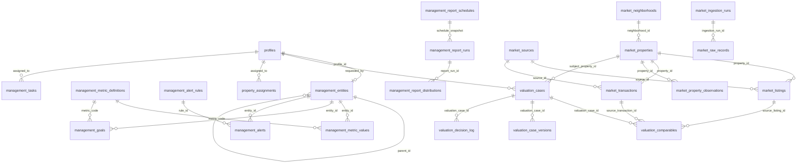

# Modelo y diccionario de datos contractual

Fecha de contraste con producción: 1 de agosto de 2026.

## 1. Convenciones

- Identificadores principales: UUID, salvo registros crudos y observaciones que usan `bigint`.
- Fechas operacionales: `date`; trazabilidad: `timestamptz`.
- Evidencia y payloads heterogéneos: `jsonb`.
- El acceso desde la aplicación usa Supabase Auth y políticas RLS.
- Las vistas contractuales usan `security_invoker=true` para conservar el alcance del usuario.
- `service_role` se reserva para automatizaciones internas; no debe llegar al navegador.

## 2. Relación general

## 3. Identidad, usuarios y operación común

### `profiles`

| Campo | Tipo | Uso |
|---|---|---|
| `id` | uuid | Coincide con `auth.users.id`. |
| `full_name` | text | Nombre visible y vínculo documental. |
| `role` | text | `admin`, `ceo`, `director`, `subdirector` o `seller`. |
| `team` | text | Oficina o ámbito organizacional. |
| `avatar_url` | text | Recurso visual opcional. |
| `created_at` | timestamptz | Alta del perfil. |

### `property_assignments`

Vincula una propiedad operacional con el perfil responsable.

Campos principales: `property_id`, `assigned_to`, `assigned_by`, `assignment_role`, `status`, `notes`, `assigned_at`, `ended_at`.

RLS: partner sólo ve sus asignaciones; dirección/subdirección ve perfiles de su oficina; CEO/administración tiene alcance global.

### `management_tasks`, `management_task_comments`, `management_task_events`

- `management_tasks`: tarea, oficina, sujeto, responsable, prioridad, estado, vencimiento y resolución.
- `management_task_comments`: comentarios con autor y fecha.
- `management_task_events`: historial de transiciones y cambios.

## 4. Módulo I — Inteligencia de Mercado

### `market_sources`

Catálogo de procedencia.

| Campo | Uso |
|---|---|
| `code` | Identificador estable de la fuente o archivo. |
| `name` | Nombre legible. |
| `source_type` | `portal`, `cbrs`, `client`, `kml` u otro autorizado. |
| `file_name`, `file_hash` | Trazabilidad del archivo. |
| `period_start`, `period_end` | Cobertura declarada. |
| `row_count` | Conteo recibido. |
| `status` | Estado operacional. |
| `metadata` | Autorización, dataset y responsable. |

### `market_ingestion_runs`

Una ejecución de ingestión. Registra `source_system`, `dataset_kind`, archivo, SHA-256, filas esperadas/recibidas/aceptadas/rechazadas, estado, tiempos y error.

### `market_raw_records`

Registro inmutable o idempotente de cada fila recibida.

Campos principales: ejecución, sistema, dataset, ID de origen, fila de archivo, hash, payload, fecha observada, estado y errores de validación.

### `market_properties`

Identidad operacional de propiedad.

| Grupo | Campos |
|---|---|
| Identidad | `canonical_key`, `rol`, `identity_status`, `identity_confidence`, `identity_evidence` |
| Ubicación | dirección normalizada, calle, número, unidad, latitud, longitud, barrio |
| Atributos | tipo, superficies, dormitorios, baños, estacionamientos, año |
| Historia | `first_seen_at`, `last_seen_at`, timestamps |

`identity_status` distingue candidato, confirmado, pendiente y rechazado. Una fila candidata no debe presentarse como identidad definitiva.

### `market_properties_canonical`

Representación contractual normalizada por registro de origen. Conserva sistema, ID, último raw record, operación, tipo, ubicación, precio, atributos, estado de publicación, completitud y problemas de calidad.

### `market_listings`

Observaciones de oferta por fuente y fecha.

Campos: fuente, ID de publicación, propiedad, operación, estado, URL, título, dirección, coordenadas, precios, UF/m², fecha publicada, fecha observada, fecha removida y payload.

La unicidad combina fuente, publicación y observación; permite historia sin sobrescribir cortes anteriores.

### `market_transactions`

Ventas registrales o del Cliente.

Campos: `event_key`, `asset_key`, propiedad, ROL, fecha, precios, UF/m², descripción, tomo, foja, número y payload.

Una transacción contractual debe tener identificador, fecha, activo identificable y precio positivo antes de materializarse.

### `market_neighborhoods`

Barrio/microbarrio, geometría GeoJSON, fuente de geometría y estado de asignación.

### `market_property_observations`

Serie de observaciones de una propiedad: fecha, precio, estado de publicación, URL, imagen y atributos.

### `market_property_matches`

Candidatos de vinculación entre entidades. Conserva score, evidencia, contradicciones, estado y revisión humana.

### `market_metric_snapshots`

Agregados por período, barrio y tipo: inventario, altas, bajas, ventas confirmadas, días de mercado, absorción y oferta/ventas. Incluye fuentes y versión metodológica.

### Vistas

- `market_current_listings`: último estado de publicaciones.
- `market_listing_history`: primera/última observación, rango de precio y actividad.
- `market_property_lifecycle`: publicación, remoción, primera venta y días de mercado.

Todas son de lectura autenticada con RLS heredado por `security_invoker`.

## 5. Módulo II — Valorización

### `valuation_cases`

Expediente central.

| Grupo | Campos |
|---|---|
| Workflow | `status`, versión, solicitante, revisor, aprobador, fechas de revisión/aprobación/emisión |
| Sujeto | tipo, dirección, barrio, área homogénea, coordenadas, ROL, superficies, dormitorios, baños, estacionamientos, año, piso |
| Resultado | valor base, estimado, inferior, superior, confianza, ajuste total |
| Criterio | factores cualitativos, condición, justificación, supuestos, advertencias |
| Evidencia | propiedad vinculada, evidencia, payload de informe, versión metodológica |

Estados canónicos: `draft`, `review`, `approved`, `issued`, con transiciones controladas.

### `valuation_comparables`

Comparable y decisión profesional.

Campos: caso, propiedad, ranking, similitud, distancia, valor base/ajustado, ajustes, evidencia, contradicciones, fuente, referencia, fecha, atributos, precio, selección/exclusión, motivo, actor y fechas.

### `valuation_case_versions`

Snapshot completo por número de versión y estado.

### `valuation_decision_log`

Acción, actor, comparable opcional, estado previo/nuevo, motivo, transición y metadata.

### `valuation_adjustment_catalog`

Catálogo de ajustes permitidos con rango mínimo/máximo, orden y estado.

## 6. Módulo III — Control de Gestión

### `management_entities`

Jerarquía organizacional.

| Campo | Uso |
|---|---|
| `entity_type` | `company`, `office`, `team`, `partner` o `agent`. |
| `name` | Nombre de compañía, oficina o persona. |
| `parent_id` | Jerarquía oficina–partner. |
| `profile_id` | Vínculo con usuario. |
| `metadata` | Equipo, fuente documental y atributos auxiliares. |
| `active` | Vigencia. |

### `management_entity_assignments`

Asignación explícita de perfiles a entidades, con rol de asignación y vigencia.

### `management_metric_definitions`

Diccionario ejecutable de KPI.

Campos: código, etiqueta, descripción, unidad, agregación, numerador/denominador, metodología, versión de fórmula, configuración y política de evaluación.

La definición no equivale a un valor productivo.

### `management_metric_values`

Valor por entidad, métrica y período.

| Campo | Uso |
|---|---|
| `value` | Valor numérico; puede ser nulo para estados no evaluables. |
| `source_name`, `source_reference`, `source_cutoff_at` | Procedencia. |
| `quality_status` | Verificado, provisional, faltante, rechazado u otro estado explícito. |
| `evaluation_status` | Evaluable, falta fuente, no aplica, no evaluable o rechazado. |
| `formula_version` | Versión usada. |
| `evidence` | Manifiesto y referencias. |

### `management_metric_reconciliations`

Compara valor publicado y calculado, delta, tolerancia, estado de conciliación, autorización de publicación y evidencia.

### `management_approved_metric_values`

Vista de publicación. Sólo expone valores:

- calculados con la fuente canónica;
- verificados y evaluables;
- conciliados exactos o dentro de tolerancia;
- aprobados por una persona autorizada.

El dashboard usa esta vista para reemplazar la métrica documental equivalente. La ausencia de un valor aprobado mantiene el fallback identificado, no inventa un dato vivo.

### `management_goals`

Meta por entidad, métrica y período. Incluye fuente, estado, versión, aprobador y nota. El dashboard sólo usa metas aprobadas.

### `management_alert_rules`

Regla configurable: métrica, comparación, umbral, severidad, alcance, responsable y vigencia.

### `management_alerts`

Resultado de evaluación: entidad, métrica, período, severidad, estado, valor, umbral, responsable y resolución.

### `management_import_runs`

Ejecución de importación: fuente, referencia, período, estado, conteos, advertencias, errores, solicitante y tiempos.

### Reportes

- `management_report_schedules`: tipo, entidad, cadencia, día, destinatarios y próxima ejecución.
- `management_report_runs`: snapshot inmutable, período, estado y generador.
- `management_report_distributions`: destinatario, canal, estado, referencia externa, error y fechas.

Un estado `pending` no demuestra entrega por correo.

## 7. Funciones de autorización relevantes

### `can_access_management_entity(uuid)`

- CEO/admin: global.
- Partner: entidad vinculada a su perfil.
- Dirección/subdirección: oficina cuyo nombre coincide con `profiles.team` y descendientes.
- Asignaciones adicionales: `management_entity_assignments` activas.

### `has_management_profile_scope(target_profile_id, viewer_id)`

Determina alcance sobre perfiles para valorizaciones y asignaciones.

### `is_global_management_leader(user_id)`

Verdadero sólo para el propio usuario autenticado con rol CEO/admin.

Estas funciones son `SECURITY DEFINER`, usan `search_path` fijo y sólo conceden `EXECUTE` a `authenticated` y `service_role`.

## 8. Estados de calidad

- `verified`: fuente y valor validados.
- `provisional`: utilizable con advertencia, no aprobado definitivamente.
- `missing`: fuente requerida ausente.
- `rejected`: fila o valor inválido.
- `not_applicable`: la métrica no corresponde a la entidad/período.
- `not_evaluable`: existen datos, pero no permiten calcular la fórmula.

La interfaz debe conservar estos estados; no convertirlos automáticamente en cero.

## 9. Tablas heredadas

Pueden existir tablas o migraciones históricas fuera del runtime contractual. No forman parte del diccionario de aceptación salvo que una ruta vigente las use explícitamente. Su eliminación requiere inventario, prueba de no uso, respaldo y autorización separada.

## 10. Mantenimiento del diccionario

Cada migración que altere el modelo contractual debe actualizar:

1. este documento;
2. la matriz contractual;
3. pruebas de RLS o modelo;
4. manuales afectados;
5. evidencia del deployment correspondiente.
